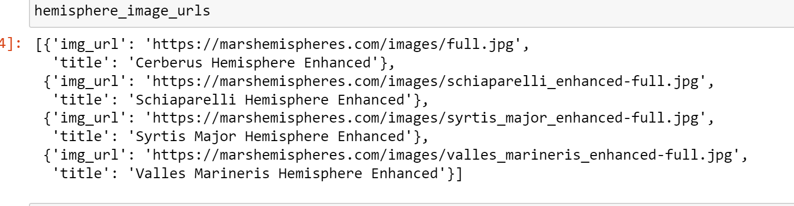
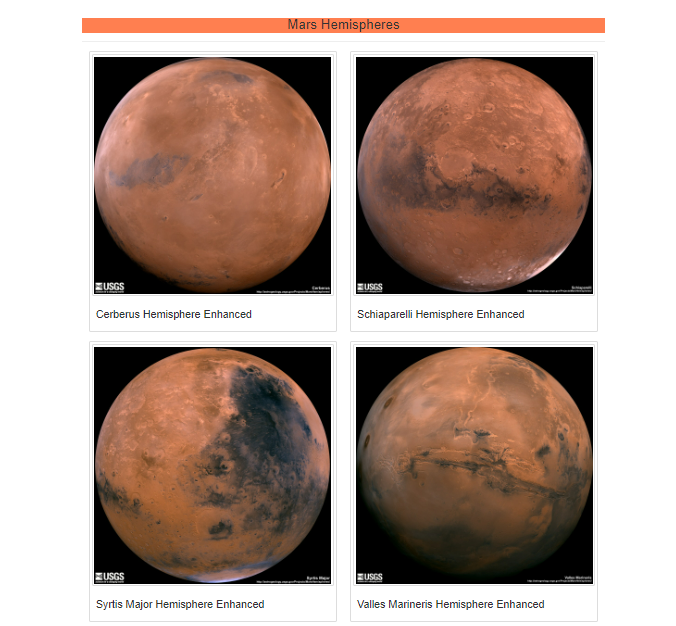

# Mission-to-Mars
Web Scraping to extract online data

HTML and Flask to display the data ,BeautifulSoup and Splinter for web scraping, MongoDB to store the data.
Bootstrap to customize the web page.

## Overview of the analysis: 

Build an app to scrape websites for data pertaining to the Mission to Mars, and then create an HTML page to display the findings and images.

## Challenge

Modify the current web app to include all four of the hemisphere images. Use BeautifulSoup and Splinter to scrape full-resolution images of Mars’s hemispheres and the titles of those images, store the scraped data on a Mongo database, use a web application to display the data, and alter the design of the web app to accommodate these images.

## Results:

### URLs:

   
 

### Images:

   
 
 
 

 
        
